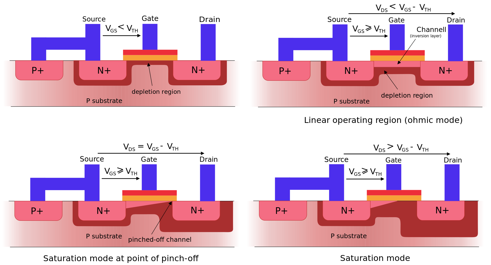

# Transistor

## MOSFET

### Mechanism

Depletion region is natuarally formed between the interface. When voltage is applied accross the gatem
The hole will be repelled, and the inversion layer consisting of mobile electrons (n-channel) will be formed,
connecting both n-type together, allowing the current to flow.

Current run from *drain* to *source* once *gate* voltage is applied.
note that electron travel in inverse direction with current.

Since electron carrier inside the drain maybe attracted to its terminal (due to incomming positive charge).
The n-channel will be contricted, and prevent more current from flowing. This is called **saturation**.

> **Why current still flow in saturation mode?**
> While the resistance of the channel increase the current will still flow
> through sillicon due to high voltage that causes the saturation.
> Causing constant current.

## CMOS

NMOS with source connected to ground can pull the output voltage to zero when positive voltage is applied at the gate.
but will output high impedance (not logic high) when off.

One can make it output logic high by adding pull-up resistor, but resistor waste energy.

But we have PMOS which do exactly opposite that is when low voltage is applied to the gate, it will conduct, and we can connect the drain to high voltage to make the output high.

So we combine it and eliminate the resistor.

Note that the circuit above is an inverter. and the power is consume when it there is switching because both MOSFET will
temporary conduct as the charges are removed from the capacitor plate.

[source](https://electronics.stackexchange.com/questions/407290/why-do-we-use-a-cmos-for-inverting-a-circuit-when-the-pmos-already-achieves-that)

### Complex Logic in CMOS

Using the same concept, we can make complex logic in CMOS by
building PMOS that will pull-up and NMOS that will pull-down. Logical expression formed
by pull-up and pull-down network **must** be complement of each other.

> **Why only use PMOS for pull-up network and NMOS for pull-down network?**
> NMOS only works when Vgs > Vt, this is perfectly fine for pull-down because Vg is high and Vt is low
> But when we use it for pull-up, Vo = Vs can't be 5V because Vg = 5V and Vgs > Vt, so Vs must be 4V to maintain Vgs
> difference
